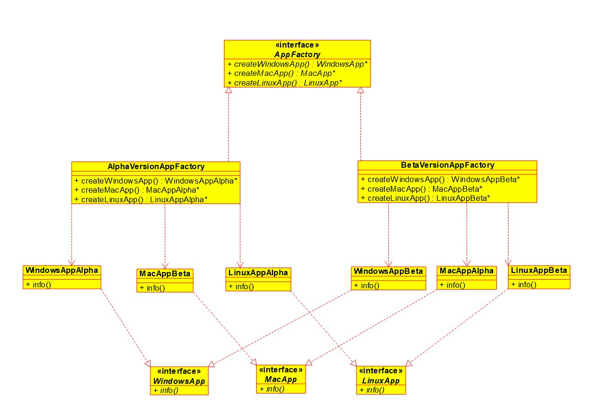

# Abstract Factory

Very similar to factory method in the sense that it can be used for creating class objects.
Here a factory class is responsible for creating objects that are different but also share a common nature.

## Problem
Lets say we are working on an app that we want to publish to Windows, Mac and Linux platform. Now the app is the same but the underlying code is different since it is platform dependent.
Or we can have different apps, but again we are targeting them for different platforms. So the products are windows, mac and linux specific and hence are different.
But now during the app development lifecycle, we will have different stages like test, alpha, beta and public. 
Each stage might have different settings, loggers, debug info for the said app.

So we want to have a creator that adds the debug settings, logger settings depending on the stage and also the platform.

So for this scenario, we have two creator base factory classes AlphaVersionAppFactory and BetaVersionAppFactory. These factories have factory methods for windows, mac and linux. 
For Alpha stage, AlphaVersionAppFactory can generate alpha versions of the apps.
For Beta stage, BetaVersionAppFactory can generate beta versions of the apps.

## Class Diagram
