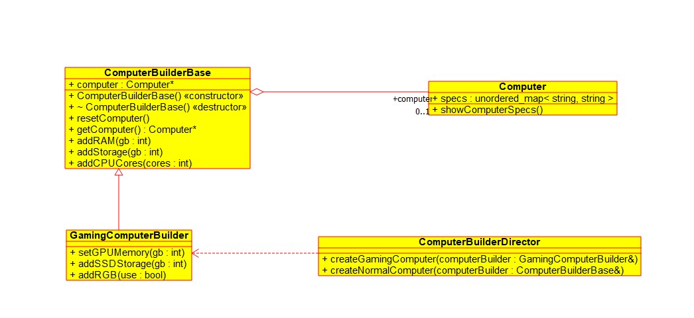

# Builder
Builder Pattern is useful when we want to create class objects that have lots of configurable properties. We create methods that deals with each of the configurable properties / aspect of the class.
Then depending on the need we can only use the methods for properties that we want in the class instance.
Often times we can also have a director that already has a specified blueprint for object creation and it takes a builder instance and using that builds a class object following the blueprint it already has.

There can be classes with lots of configurable properties. Now to account for
the possible variations, we can create subchildren that inherit from the base class and have the necessary changes to make it different from others.

## Problem
There can be classes with lots of configurable properties. Now to account for
the possible variations, we can create subchildren that inherit from the base class and have the necessary changes to make it different from others.
Now if we start creating subchildren for all possible variants, we can quickly get overwhelmed. So instead we create a builder class that helps us create the product instance with the properties we need.
Create a method to handle an individual property/aspect of the class. Then
using the builder only use the methods that we need for the creation.

## Class Diagram
