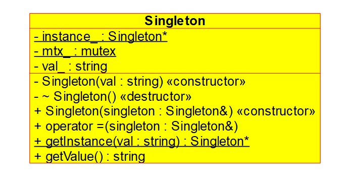

# Singleton
In singleton pattern, we limit the creation of a class object to 1. The way it is done is by hiding the constructor, copy constructor of the class. We create a method that takes care of object creation and it only creates object when there isn't one in existence.
Once an object has been created, it is reused whenever someone asks for it.

## Problem
Imagine a scenario where we have a class object that needs a lot resources or where we want to limit existence of a class object to 1 for any other reason. This is where we use singleton pattern to limit the creation of object to 1.

## Class Diagram
