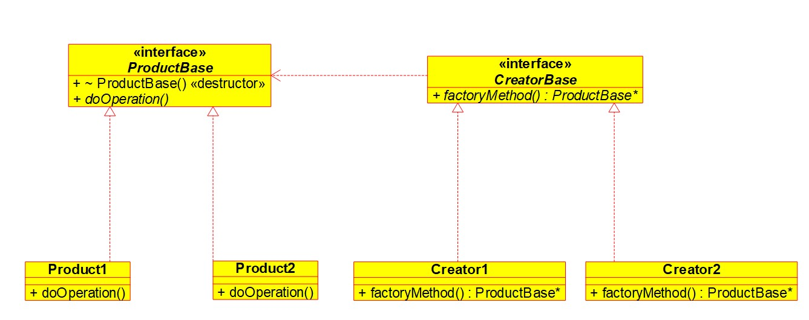

# LLD-Design-Patterns
Design Patterns in C++

## Creational Patterns

### 1. Factory Method

[Factiry Method (More details)](Creational/Factory_Method/factory_method.md)

It is a design pattern which can be used in scenarios where we are dealing with creation of an object.
Suppose we are dealing with products of certian kind, e.g., wooden objects. Now we can have wooden chairs, tables, doors etc and each can have variety of models.

**Another Use Case**

When we want to control object creation, let's say we have limited resources and want to only have certain no. of objects. Then using a factory, we can reuse released objects and ensure that only certain no. of objects are in existence.

**Class Diagram**

### 2. Abstract Factory
[Abstract Factory (More details)](Creational/Abstract_factory/abstract_factory.md)

Very similar to factory method in the sense that it can be used for creating class objects.
Here a factory class is responsible for creating objects that are different but also share a common nature.
E.g we have an app for windows, mac and linux. We have two implementations of factory classes, one that creates alpha version of app and one that creates beta version of app.

**Class Diagram**

## Structural Patterns

## Behavioral Patterns
