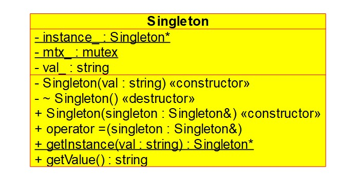

# LLD-Design-Patterns
**Design Patterns in C++**

## Creational Patterns

### 1. Factory Method

[Factiry Method (More details)](Creational/Factory_Method/factory_method.md)

It is a design pattern which can be used in scenarios where we are dealing with creation of an object.
Suppose we are dealing with products of certian kind, e.g., wooden objects. Now we can have wooden chairs, tables, doors etc and each can have variety of models.

**Another Use Case**

When we want to control object creation, let's say we have limited resources and want to only have certain no. of objects. Then using a factory, we can reuse released objects and ensure that only certain no. of objects are in existence.

**Class Diagram**

### 2. Abstract Factory
[Abstract Factory (More details)](Creational/Abstract_factory/abstract_factory.md)

Very similar to factory method in the sense that it can be used for creating class objects.
Here a factory class is responsible for creating objects that are different but also share a common nature.
E.g we have an app for windows, mac and linux. We have two implementations of factory classes, one that creates alpha version of app and one that creates beta version of app.

**Class Diagram**

### 3. Builder
[Builder (More details)](Creational/Builder/builder.md)

Builder Pattern is useful when we want to create class objects that have lots of configurable properties. We create methods that deals with each of the configurable properties / aspect of the class.
Then depending on the need we can only use the methods for properties that we want in the class instance.
Often times we can also have a director that already has a specified blueprint for object creation and it takes a builder instance and using that builds a class object following the blueprint it already has.

There can be classes with lots of configurable properties. Now to account for
the possible variations, we can create subchildren that inherit from the base class and have the necessary changes to make it different from others.

**Class Diagram**

### 4. Singleton
[Singleton (More details)](Creational/Singleton/singleton.md)

In singleton pattern, we limit the creation of a class object to 1. The way it is done is by hiding the constructor, copy constructor of the class. We create a method that takes care of object creation and it only creates object when there isn't one in existence.
Once an object has been created, it is reused whenever someone asks for it.

Imagine a scenario where we have a class object that needs a lot resources or where we want to limit existence of a class object to 1 for any other reason. This is where we use singleton pattern to limit the creation of object to 1.

**Class Diagram**

## Structural Patterns

## Behavioral Patterns
