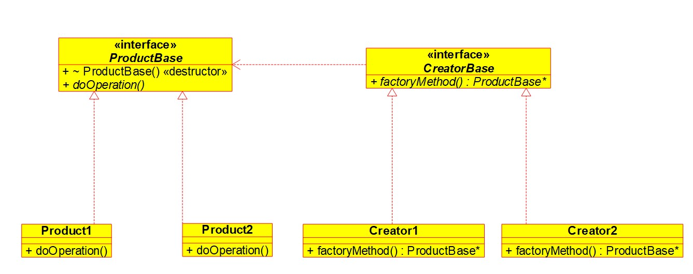

# Factory Method

It is a design pattern which can be used in scenarios where we are dealing with creation of an object.
Suppose we are dealing with products of certian kind, e.g., wooden objects. Now we can have wooden chairs, tables, doors etc and each can have variety of models.

## Problem
If the client directly starts writing the creation logic and future we want to introduce some change, then the client might have to undergo the changes as well.

Ideally client shouldn't be bothered with how the object is created, i.e how its constructors params are, it should just specify properties it needs and get the object. This is exactly what factory method does.

Factory method takes in the properties and creates objects for the client.
To make things general, we let all the wooden objects inherit from abstract(or interface) WoodenObjectsBase. Then for all the factories, we also introduce a base class WoodenFactoryBase. Now we can have factories like WoodenChairFactory, WoodenTableFactory etc.

## Another Use Case
When we want to control object creation, let's say we have limited resources and want to only have certain no. of objects. Then using a factory, we can reuse released objects and ensure that only certain no. of objects are in existence.

## Class Diagram
